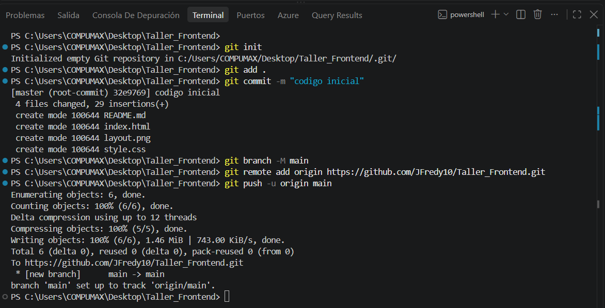
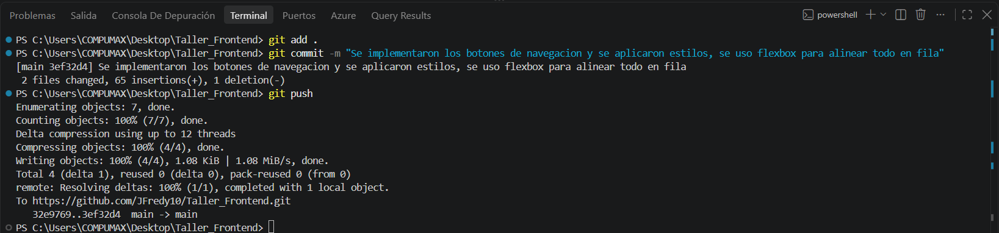
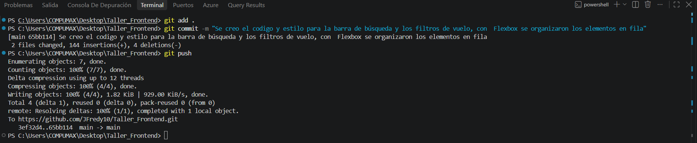
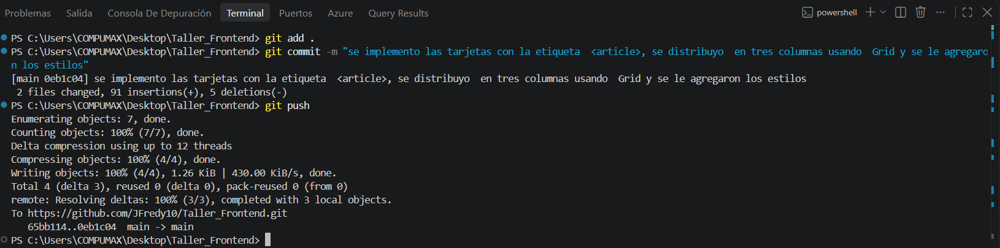
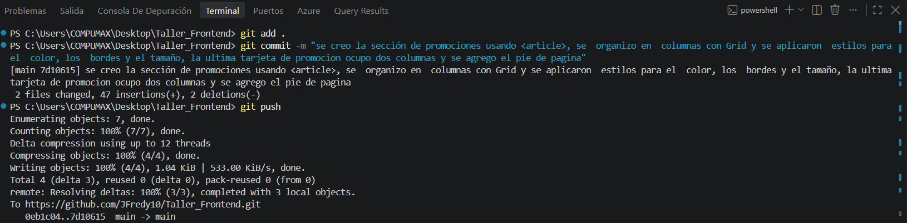
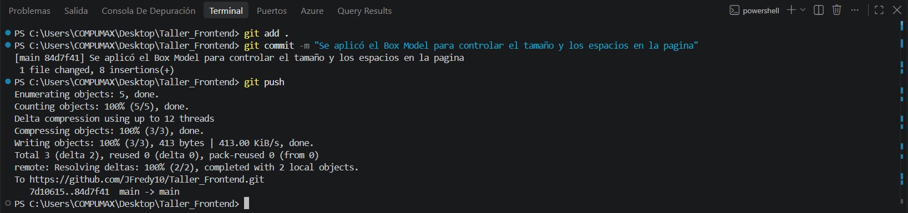

## Reserva de vuelos

#### Layout

### Explicacion y Reflexion
Se creo una pagina de reservas de vuelos, para esto se analizo como se encontraba estructurada la pagina de referencia en este caso fue la pagina de LATAM Airlaines, se creo el layout a partir de esta pagina, con esto se realizo la implementacion del codigo html y css, donde se aplico Grid y flexbox donde era necesario.

Se uso Grid principalmente en las tarjetas de destinos y promociones porque se necesitaba distribuir varios elementos en filas y columnas. por esto elegí esta opción ya que me permitió mantener las tarjetas del mismo tamaño para que la página se viera ordenada, sin que todo quedaran amontonados.

Se hizo uso de Flexbox en el menú de navegación, los filtros y la barra de búsqueda porque en esas partes los elementos están organizados principalmente en una sola fila. Fue de ayuda para separar los textos y botones, y también para mantener todo alineado de una forma más sencilla.
Algo muy importante es que cada herramienta sirve para organizar la página de una manera diferente de manera flexible, combinando Grid y flexbox.
El objetivo principal es desarrollar el taller de Flexbox y Grid, enfocándose en la estructura y distribución visual del contenido.

### Commits

<h4> 1. </h4>

<h4> 2. </h4>

<h4> 3. </h4>

<h4> 4. </h4>

<h4> 5. </h4>

<h4> 6. </h4>

